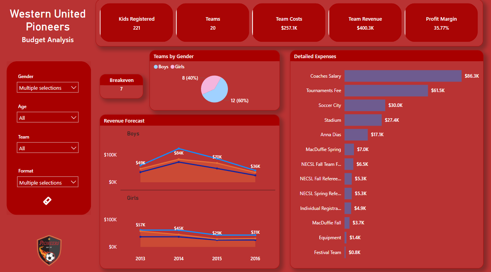

# Welcome to My Power BI Portfolio! 🎉

Hello! I'm **Gianluca Cersosimo**, a Financial Analyst and Power BI enthusiast. This website showcases my interactive dashboards and analytics projects.

---

## 🌟 About Me
- 🎓 M.S. in Finance and Financial Analytics, University of New Haven.
- 📈 Experienced in creating data-driven insights and visualizations.
- 💼 Freelance data solutions provider.

---

## 📊 Featured Projects

### 1. **Sales Performance Dashboard**
- **Description:** A dashboard analyzing sales performance across regions, products, and teams.
- **Tools:** Power BI, DAX, SQL
- **Highlights:** Drill-through capabilities, KPI tracking.
- **Preview:**
- 
<iframe title="Lista de Ventas" width="1140" height="541.25" src="https://app.powerbi.com/reportEmbed?reportId=5db2dac0-3a7a-4628-97f1-07a93d17d0b6&autoAuth=true&ctid=3c71cbab-b5ed-4f3b-ac0d-95509d6c0e93" frameborder="0" allowFullScreen="true"></iframe>

---

### 2. **Financial Analysis Report**
- **Description:** A financial report for tracking revenue, expenses, and profitability over time.
- **Tools:** Power BI, Excel
- **Highlights:** Trend analysis, dynamic filters.
- **Preview:**  
  
<iframe title="WUP Budget Report" width="1140" height="541.25" src="https://app.powerbi.com/reportEmbed?reportId=75e2a1f9-a3cf-4c84-ba37-f4895bc85253&autoAuth=true&ctid=3c71cbab-b5ed-4f3b-ac0d-95509d6c0e93" frameborder="0" allowFullScreen="true"></iframe>

---

### 3. **Customer Insights Dashboard**
- **Description:** Insights into customer demographics, behaviors, and satisfaction.
- **Tools:** Power BI, R
- **Highlights:** Heatmaps, demographic segmentation.
- **Preview:**  
  
[View Interactive Dashboard](https://app.powerbi.com/yourdashboardlink)

---

## 📬 Contact Me
- 📧 Email: [gianlucacerso@gmail.com](mailto:gianlucacerso@gmail.com)
- 💼 LinkedIn: [linkedin.com/in/yourprofile](https://www.linkedin.com/in/gianluca-cersosimo-0410191aa/)
- 🌐 Website: [Gianluca's Analytics](https://yourwebsite.com)

---

### 🚀 How This Portfolio Was Built
This site is hosted on **GitHub Pages** and designed using Markdown. Feel free to explore the repository and its code.

---

**Thank you for visiting! Let’s collaborate to turn data into actionable insights!**
